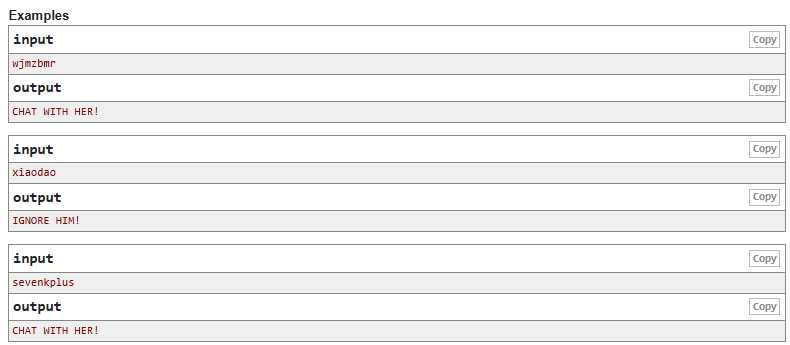

# 236 A. Boy or Girl
Third Evidence for the Subject of Computational Implementation. For this evidence, a problem in CodeForces was chosen so that the Paradigm can be implemented.

The problem 236 A. Boy or Girl, is a Code Forces problem. The problem is about a young man that likes to be on the internet, he talks with a lot of girls. One time, he was talking with a girl but in reality, it was a guy. He was so embarrassed about the situation, that he gave up on love completly. In order for this not to happen again, he has developed the following method: if the number of distinct characters in one's user name is odd, then he is a male, otherwise she is a female. You are given the string that denotes the user name, please help our hero to determine the gender of this user by his method: if the number of distinct characters in one's user name is odd, then he is a male, otherwise she is a female. You are given the string that denotes the user name, please help our hero to determine the gender of this user by his method.

Based on this, the platform has given mi a series of outputs and inputs that I should consider in order to help him, diffirenciate between female and male.


Link to the problem: https://codeforces.com/problemset/problem/236/A

## Understanding the problem
In order to help our character, we need to understand that it is based in only the distinct characters. Meaning, that if a character repeats itself, then it is only count as one. For example in the string "wjmzbmr", m is repeated twice so it is only modeled as one.
```
w j m z b m r -> w j m z b r
= 6 (even)
= Female
```

Having ths logical part of the solution of the problem and undrstanding that no characters can repeat itself, we can now choose a paradigm to solve the problem. In this case, I chose functional as my principal paradigm and logical paradigm as my secondary. But first we need to understand some important knowledge about it. 

## Curiosity
I chose this problem, because I thought it would be interesting to understand how to use the lambda calculus combining the strings. The complexity of the code is on making the list of the string unique. That is why I chose this problem.

# Functional Paradigm
## Context
A functional paradigm is the one that encourages program development to be used purely using functions and mathematical processes. To understand functional paradigm we need to talk about Lambda calculus, it was developed by Alonso Church, it gives us a theorical model that describe functions and their evaluations.

### Pure Functions
The objective of having pure functions, reads as follow:
- They allways produce the same output for the same arguments.
- They do not modify any arguments ot global/logical variables, the only impotant thing here is the output that it gives.

This helps us have a more clean and steady code, they are also easy to debug because they have no hidden inputs or outputs.

### Recursion
In functional languages there are no "for" or "while" loops. This is implemented through recursion, which are the ones that call themselves until a base case is achieved.

### Referential Transparency
Once a variable is defined, they cannot change their value through out the program, so if you want to store a variable we have to define new variables. Ths eliminates any case of side effects because any variable can be replaced with its actual value

### Variables are Immutable
In a functional program we cannot modify a variable after it has been initialized. We can reate new variables, but not change them. Some advatages are what it follows:
- Pure functions are easier to understand because they don’t change any states and depend on the input. Whatever output they produce is the return value they give. 
- Because functions are used as variables, then this makes the code more readable and easier to process.
- Testing and debugging is easier: beacause functions take only aguments and produce an output.
- It avoids repeated code: because functions are only used when necessary, it avoids using useless code.


## Models
As we have talked before. Functional Paradigm is based on functions. In order to get the solution of the problem I created different functions that would help us. In order t better understand this problem, the inputs were managed thrugh lists. As this is how you can move recursively in the function.

The first functions eliminates any duplicate of any letter, meaning that a letter is chosen and compared with the rest of the list. The base case is when the list is completely empty and if a letter is repeated it is only added to the final list once. By doing this we are clearing the list so that we can avoid any copy letter.

```Racket
;;Function 1
;; We define a function that eliminates duplicates
(define (fun-elim-dup my_list final_list)
  (cond
    ;;caso base
    ;;llegamos al caso base
    ;;1. cuando la lista esta vacia
    [(empty? my_list) final_list]
    ;;2. cuando a la lista le queda un caracter
     [(member (first my_list) final_list)
     (fun-elim-dup (rest my_list) final_list)]
    [else
     (fun-elim-dup (rest my_list) (cons (first my_list) final_list))]))
```
For the second function, we define a function where we can get the length of a list, so a counter is used in order to get the final length of the list.

```Racket
(define (length-list my_list contador)
  (cond
    [(empty? my_list) contador]
    [else (length-list (rest my_list) (+ contador 1))]))
```

Finally, we have our Lambda function that is the one that tells us if it is a girl or a boy behind the username. As we can see other functions are called here in order to get the solution

```Racket
;;Lambda
;;We use lambda to define if it is a Girl or a Boy
(define boy-or-girl
  (lambda (s)
    (if (even? (length-list (fun-elim-dup s '()) 0))
        "CHAT WITH HER!"
        "IGNORE HIM!")))
```

Throughout the different functions recursion is implemented so that we can get through the list that it is given

## Tests

For the tests, the first sentences should give encourage you to chat with thi girls:

```Racket
;; Woman users (CHAT WITH HER!)
(define my_list_1  '(a b c d))                   ; 4 únicos: a b c d
(define my_list_2  '(r a c k e t))               ; 6 únicos: r a c k e t
(define my_list_3  '(h e l l o))                 ; 4 únicos: h e l o
(define my_list_4  '(m o n k e y))               ; 6 únicos: m o n k e y
(define my_list_5  '(s e v e n k p l u s))       ; 8 únicos: s e v n k p l u
(define my_list_6  '(a a b b c c d d))           ; 4 únicos: a b c d
(define my_list_7  '(p y t h o n))               ; 6 únicos: p y t h o n
(define my_list_8  '(r u b y))                   ; 4 únicos: r u b y
(define my_list_9  '(e r l a n g))               ; 6 únicos: e r l a n g
(define my_list_10 '(h a s k e l l))             ; 6 únicos: h a s k e l
(define my_list_11 '(k o t l i n))               ; 6 únicos: k o t l i n
(define my_list_12 '(a b c d e f g h))           ; 8 únicos: a b c d e f g h
(define my_list_13 '(a a b b c c d d e e f f))   ; 6 únicos: a b c d e f
```

Meanwhile, the male usernames or Ignore him result are as follow: 

```Racket
;; Male. Ignore him solution
(define my_list_14 '(s w i f t))                 ; 5 únicos: s w i f t
(define my_list_15 '(x i a o d a o))             ; 5 únicos: x i a o d
(define my_list_16 '(a b c))                     ; 3 únicos: a b c
(define my_list_17 '(p r o l o g))               ; 5 únicos: p r o l g
(define my_list_18 '(z z z z z))                 ; 1 único:  z
(define my_list_19 '(a a b b c))                 ; 3 únicos: a b c
(define my_list_20 '(s c h e m e))               ; 5 únicos: s c h e m
(define my_list_21 '(c l o j u r e))             ; 7 únicos: c l o j u r e
(define my_list_22 '(a b c d e))                 ; 5 únicos: a b c d e
(define my_list_23 '(a a b b c c d d e))         ; 5 únicos: a b c d e
(define my_list_24 '(j a v a s c r i p t))       ; 9 únicos: j a v s c r i p t
(define my_list_25 '(g o l a n g))               ; 5 únicos: g o l a n
```
This tests are also found in Racket code.
## Analysis
### Complexity
The program has a complexity of O(n), because we use functions in functions but that is less expensive than usng while and for cycles. Also, the list is only traveled through once. 

### Another Paradigm
Another paradigm implemented s the logical one, using Prolog. In here it is implemented similarly as in racket except that a path is more clearly seen here.

### Other Solution
As told before the other solution is using logical paradigm, with prolog and eventhough the racket solution is better. Prolog it's not a bad idea to be used to solve the problem.

### Reference
http://theswissbay.ch/pdf/Gentoomen%20Library/Programming/Functional%20Programming/Functional%20Programming%20For%20The%20Real%20World.pdf


